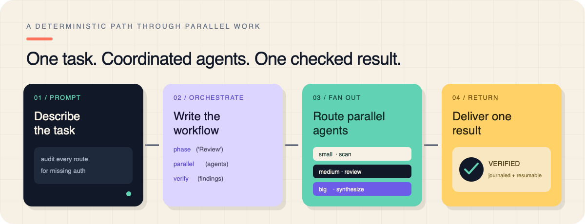

# Pi Dynamic Workflows

> A hardened Pi package for running deterministic JavaScript workflows across parallel subagents, with model routing, background execution, resume journals, team coordination, result delivery, and an interactive run UI.



## What this package provides

After installation, Pi gains:

- `start_workflow` — a stable, start-only tool for a generated script or curated built-in preset.
- `list_active_workflows` — a stable, current-session list of exact cancellation handles.
- `get_workflow_output` — a one-shot, interruptible wait for one current-session run; it replaces list/sleep polling.
- `stop_workflow` — a stable, exact-ID cancellation handle limited to runs owned by the current Pi session.
- `/workflows` — interactive workflow navigator.
- `/workflows status|watch|pause|resume|stop|steer` — explicit lifecycle and existing-run commands.
- `/workflows-models` — configure `small`, `medium`, and `big` model tiers.
- `/deep-research`, `/code-review`, `/codebase-audit`, `/adversarial-review`, and `/multi-perspective`.
- Workflow-scoped Agent Teams with peer messages, inboxes, and a shared task board.
- One bounded background workflow result is delivered to the main session using Pi's safe-point steering queue; an active provider request is not cancelled. Routine per-subagent finals stay in the run journal/pager instead of consuming parent context.

The extension uses the stock Pi extension API and keeps compact start, active-list, output-wait, and exact-ID stop definitions registered. Its provider-visible prefix therefore stays stable for prompt caching; there is no per-turn tool lease or dynamic `setActiveTools` rewrite. The list returns only current-session running/paused handles. `get_workflow_output` waits on lifecycle events once (10 minutes by default); Esc cancels only that wait, not the workflow. Stop requires one exact ID. Other existing-run actions stay under `/workflows`; a new requirement is never routed into an unrelated run.

## Requirements

- Node.js 20 or newer is recommended.
- [`@earendil-works/pi-coding-agent`](https://www.npmjs.com/package/@earendil-works/pi-coding-agent) version `0.84.2` or newer.
- The extension uses Pi's public extension API; no Pi core patch or fork is required.
- At least one authenticated model/provider configured in Pi.
- Git is optional, but required when a workflow requests `isolation: "worktree"`.

## Install from GitHub

Install globally for the current Pi user:

```bash
pi install git:github.com/YukiRa1n/pi-dynamic-workflows
```

For a reproducible installation, pin a release tag once tags are available:

```bash
pi install git:github.com/YukiRa1n/pi-dynamic-workflows@v3.5.1-yuki.3
```

Reload Pi after installation:

```text
/reload
```

To test the package for one Pi process without keeping it installed:

```bash
pi -e git:github.com/YukiRa1n/pi-dynamic-workflows
```

### Project-level installation

To record the package in a project's `.pi/settings.json` instead of user settings:

```bash
pi install -l git:github.com/YukiRa1n/pi-dynamic-workflows
```

Commit `.pi/settings.json` if the whole team should receive the same package declaration. Pi will install missing project packages after the user trusts the project.

## Update or uninstall

Update unpinned Git packages:

```bash
pi update --extensions
```

Move a pinned installation to another tag:

```bash
pi install git:github.com/YukiRa1n/pi-dynamic-workflows@NEW_TAG
```

Remove the package:

```bash
pi remove git:github.com/YukiRa1n/pi-dynamic-workflows
```

## First-use setup

### 1. Confirm that Pi loaded the package

```bash
pi list
```

Inside Pi, open:

```text
/workflows
```

The compact `start_workflow`, `list_active_workflows`, `get_workflow_output`, and `stop_workflow` tools are stable across turns. Start accepts a custom `script` or curated `preset`; list returns only current-session running/paused handles; output waits once for an exact ID instead of polling; stop accepts one exact ID. Saved names, limits, replay, detailed inspection, pause, resume, and steering remain command/UI paths under `/workflows`.

### 2. Configure model tiers

Run:

```text
/workflows-models
```

Map the available authenticated models to the `small`, `medium`, and `big` tiers. A workflow can also select an exact model with `model: "provider/modelId"`.

### 3. Run a simple workflow

Ask Pi naturally:

```text
Run a workflow with one subagent that replies "workflow installed successfully".
```

Or use the explicit command path:

```text
/workflows run Review the current project from three independent perspectives and synthesize the findings.
```

Workflow tool runs are always backgrounded, so Pi remains usable while subagents run. Terminal results return automatically through the durable safe-point delivery queue; users can inspect progress with `/workflows`.

## Built-in workflow patterns

| Pattern | Example |
| --- | --- |
| Deep research | `/deep-research Compare two libraries using primary sources.` |
| Code review | `/code-review HEAD~3..HEAD` |
| Codebase audit | `/codebase-audit src "unsafe input handling" "missing error boundaries"` |
| Adversarial review | `/adversarial-review Check this migration plan for hidden failure modes.` |
| Multiple perspectives | `/multi-perspective "Should this service be split?" security operations architecture` |

The same patterns can be invoked through the `start_workflow` tool with `preset` and `args`.

## Writing a workflow

A workflow is constrained JavaScript orchestration code. Its first statement exports metadata and it must call `agent()` at least once:

```js
export const meta = {
  name: "parallel_review",
  description: "Review a change from several independent perspectives",
  phases: [{ title: "Review" }, { title: "Synthesis" }],
};

phase("Review");
const findings = await parallel([
  () => agent("Review the current diff for correctness.", { label: "correctness" }),
  () => agent("Review the current diff for security.", { label: "security" }),
  () => agent("Review the current diff for maintainability.", { label: "maintenance" }),
]);

phase("Synthesis");
return await agent(
  "Deduplicate, verify, and prioritize these findings:\n\n" + findings.join("\n\n"),
  { tier: "big", label: "synthesis" },
);
```

Important globals include:

<!-- BEGIN GENERATED SUPPORTED WORKFLOW CAPABILITIES -->
| Name | Classification | Signature | Options and defaults |
| --- | --- | --- | --- |
| agent | runtime-global | `agent(prompt, options?) => Promise<string \| structured value \| null>` | `label`: string (optional; default: derived from phase and call count)<br>`phase`: string (optional; default: current phase)<br>`schema`: plain JSON Schema (optional)<br>`model`: string (optional)<br>`tier`: string (optional)<br>`isolation`: "worktree" (optional)<br>`agentType`: string (optional)<br>`timeoutMs`: number \| null (optional; default: run timeout; null disables)<br>`retries`: number (optional; default: run retry count) |
| parallel | runtime-global | `parallel(thunks[] \| ...thunks) => Promise<Array<unknown \| null>>` | — |
| pipeline | runtime-global | `pipeline(items, ...stages) => Promise<Array<unknown \| null>>` | — |
| createTeam | runtime-global | `createTeam(name, options?) => AgentTeam` | — |
| workflow | runtime-global | `workflow(savedName, childArgs?) => Promise<unknown>` | — |
| verify | runtime-global | `verify(item: unknown, options?: { reviewers?: number; threshold?: number; lens?: string \| string[] }) => Promise<{ real: boolean; realCount: number; total: number; votes: Array<{ real: boolean; reason?: string }> }>` | `reviewers`: number (optional; default: 2)<br>`threshold`: number (optional; default: 0.5)<br>`lens`: string \| string[] (optional) |
| judgePanel | runtime-global | `judgePanel(attempts: unknown[], options?: { judges?: number; rubric?: string }) => Promise<{ index: number; attempt: unknown; score: number; judgments: Array<{ score: number; reason?: string }> } \| undefined>` | `judges`: number (optional; default: 3)<br>`rubric`: string (optional; default: "overall quality and correctness") |
| loopUntilDry | runtime-global | `loopUntilDry(options: { round: (roundIndex: number) => unknown[] \| Promise<unknown[]>; key?: (item: unknown) => string; consecutiveEmpty?: number; maxRounds?: number }) => Promise<unknown[]>` | `round`: (roundIndex: number) => unknown[] \| Promise<unknown[]> (required)<br>`key`: (item: unknown) => string (optional; default: JSON.stringify)<br>`consecutiveEmpty`: number (optional; default: 2)<br>`maxRounds`: number (optional; default: 50) |
| completenessCheck | runtime-global | `completenessCheck(taskArgs: unknown, results: unknown) => Promise<{ complete: boolean; missing?: string[] } \| null>` | — |
| retry | runtime-global | `retry(thunk: (attempt: number) => unknown \| Promise<unknown>, options?: { attempts?: number; until?: (result: unknown) => boolean }) => Promise<unknown>` | `attempts`: number (optional; default: 3)<br>`until`: (result: unknown) => boolean (optional; default: accept first result when omitted) |
| gate | runtime-global | `gate(thunk: (feedback: string \| undefined, attempt: number) => unknown \| Promise<unknown>, validator: (value: unknown) => { ok: boolean; feedback?: string } \| Promise<{ ok: boolean; feedback?: string }>, options?: { attempts?: number }) => Promise<{ ok: boolean; value: unknown; attempts: number }>` | `attempts`: number (optional; default: 3) |
| checkpoint | runtime-global | `checkpoint(prompt, options?) => Promise<unknown>` | `default`: unknown (optional; default: true when no UI and omitted)<br>`headless`: "default" \| "abort" (optional; default: "default")<br>`kind`: "confirm" \| "input" \| "select" (optional; default: "confirm")<br>`choices`: string[] (optional)<br>`timeoutMs`: number (optional) |
| log | runtime-global | `log(message) => void` | — |
| deliver | runtime-global | `deliver({ kind, message }) => Promise<void>` | `kind`: "blocker" \| "critical_finding" \| "decision" (required)<br>`message`: string (required) |
| phase | runtime-global | `phase(title, options?) => void` | `budget`: number (optional) |
| args | runtime-global | `args: unknown` | — |
| cwd | runtime-global | `cwd: string` | — |
| process | runtime-global | `process: { cwd(): string }` | — |
| budget | runtime-global | `budget: { total, spent(), remaining() }` | — |
| script | workflow-tool-input | `script?: string` | — |
| name | workflow-tool-input | `name?: string` | — |
| args | workflow-tool-input | `args?: Record<string, unknown>` | — |
| maxAgents | workflow-tool-input | `maxAgents?: number = 1000` | — |
| concurrency | workflow-tool-input | `concurrency?: number` | — |
| agentRetries | workflow-tool-input | `agentRetries?: number = configured value or 0` | — |
| agentTimeoutMs | workflow-tool-input | `agentTimeoutMs?: number = configured default or no per-agent limit` | — |
| workflowTimeoutMs | workflow-tool-input | `workflowTimeoutMs?: number = 30 minute default, up to 24 hours` | — |
| tokenBudget | workflow-tool-input | `tokenBudget?: number = configured default or unlimited` | — |
<!-- END GENERATED SUPPORTED WORKFLOW CAPABILITIES -->

The generated table describes the full workflow authoring/library contract. The model-facing `start_workflow` surface is intentionally smaller: `script`, `preset`, and `args`. Programmatic embedders can opt into saved names, resource controls, and the separate `resumeFromRunId` compatibility path with `createWorkflowTool({ allowResume: true })`; the Pi extension never exposes those fields.

See the [workflow authoring guide](docs/workflow-authoring.md) for the generated capability contract and the packaged skill for detailed authoring instructions and examples:

```text
skills/workflow-authoring/
skills/workflow-patterns/
```

## Runtime behavior

- Workflow tool invocations always start in the background. Terminal results return automatically through the durable safe-point delivery queue. Use the returned run ID with `/workflows status|watch|pause|resume|stop|steer <id>` for explicit inspection and lifecycle actions. A new user requirement starts in the main session or a fresh workflow; it is never sent to an existing unrelated run.
- `concurrency` is bounded by the runtime maximum.
- `maxAgents`, retry counts, per-agent timeouts, and optional token budgets can be set per run. Every workflow also has a finite logical wall-clock deadline (30 minutes by default, configurable up to 24 hours with `workflowTimeoutMs`).
- A deadline races the complete script frame, closes admission, and aborts cooperative provider attempts. It cannot interrupt a pending Promise or a microtask-starved event loop; late provider settlement is observed and bounded drain cleanup is best effort.
- Replay identity is run-scoped: provider context such as `cwd`, instructions, tools, and session is hashed once and included in each call key. Nested and retried calls cannot collide on a bare call index. A resumed workflow replays the unchanged completed prefix and runs changed/new calls live.
- Anthropic-compatible, non-worktree fan-out uses a short cache-warm gate: one compatible request leads, and followers are released when its first assistant response starts. Set `PI_CACHE_RETENTION=none` to disable the gate; `short` is the default and `long` keeps the warm window longer.
- `isolation: "worktree"` is fail-closed: if a Git worktree cannot be created, that agent does not silently edit the shared checkout.
- Explicit child-to-parent `deliver({ kind, message })` messages and the single terminal workflow result use the durable safe-point delivery path with `triggerTurn: true`. Explicit messages must be classified as `blocker`, `critical_finding`, or `decision`; progress and routine results stay in logs/finals. Delivery waits for the next safe point and does not abort an already-running provider request.
- Explicit delivery admission is finite per run: at most 32 messages, 256 KiB of UTF-8 payload, and 8 messages per 10-second window. A rejected delivery reports `DELIVERY_BUDGET_EXCEEDED`; terminal lifecycle delivery is reserved and is never downgraded or displaced by an explicit burst.
- Automatic per-subagent final reports are retained in `/workflows` details and persisted run JSON, but are not injected into the parent model context by default. Execution order is not used to guess that the last agent is the final product.
- The workflow's explicit return value is the semantic terminal product. Its provider projection prioritizes conventional `report`, `synthesis`, `summary`, or `answer` fields and is bounded to 12,000 characters; omitted content remains in the persisted run.
- Workflow custom messages are converted to synthetic tool-call/tool-result semantics for normal provider context. Compaction and branch-summary preparation sanitizes workflow custom entries so they do not become user-authored text.

## Persistence and privacy

Runtime state is not stored in this repository. It is written under the user's Pi workflow directory, normally:

```text
~/.pi/workflows/
```

This can include:

- run scripts and arguments;
- journals and final results;
- compact agent history;
- token/cost accounting;
- saved workflows and model-tier configuration.

Full subagent transcripts are in memory by default. Enabling `persistAgentSessions` stores full child sessions in Pi's session directory and may retain sensitive source or prompt material. Enable it only when that retention is desired. `PI_CACHE_RETENTION=none` is separate: it disables the Anthropic cache-warm gate, not durable workflow journals.

Accepted explicit deliveries and terminal notifications are written to the run's durable at-least-once outbox before safe-point submission. Delivery IDs remain stable across reloads and retries; provider-context projection is acknowledged at `before_provider_request`, while transport confirmation is best effort after the provider response. This provides stable-ID projection deduplication and durable at-least-once delivery, not provider-side or end-to-end exactly-once processing. Outbox records are removed only after the generation-fenced acknowledgement; uncertain sends remain replayable from the persisted run.

Resource admission is finite by default: each run allows at most 1,000 logical agents and 16 concurrent agents, each `parallel()`/`pipeline()` fan-out is capped at 10,000 items, logs are capped at 10,000 entries/2 MiB, provider prompts at 512 KiB, shared-store state at 2,048 keys/4 MiB, and one durable run record at 16 MiB. Team members/tasks/messages and paused in-memory snapshots also have bounded defaults. These are admission/retention failures, not truncation: complete durable results are either committed as native JSON or publication fails observably. Paused runs evicted from memory remain resumable from disk.

Before sharing run-state files or session files, inspect them separately. They are deliberately not part of this Git repository.

## Security notes

Pi packages execute with the current user's system permissions. Review extension source before installing any third-party package.

Additional boundaries:

- Workflow orchestration uses Node's `vm` for determinism and synchronous execution limits, **not as a hostile-code security sandbox**. Host-provided arguments are copied into the VM realm without host constructors, and injected bridge functions are wrapped in vm-realm closures so their `.constructor` chain and return values stay in-realm. Because these are best-effort guards rather than a proof, model-authored custom scripts passed to `start_workflow` are additionally statically audited before execution: the audit rejects constructs that defeat the in-realm guards (dynamic code execution via `eval`/`Function`, computed member access and `for...in` string-keyed reflection, literal `.constructor`/`.prototype`/`__proto__` member access, `__proto__` object keys, `import`, `with`, `globalThis`/`Reflect`/`Proxy`/`Object.*` cross-realm reflection, and free references to host-reachable globals), and blocks the tool call with a fix list. Audited scripts run without user confirmation; curated built-in `preset`s are not gated.
- The orchestration script cannot directly call `require`, import modules, or use nondeterministic `Date.now()`/`Math.random()` globals, but subagents can use whatever tools the host grants them. The static audit narrows script structure; it does not bound model behaviour, so run resource limits (agent count, concurrency, token budget) remain the cost guardrails.
- Built-in web fetch tools restrict protocols, credentials, redirects, private/local IP ranges, timeout, and response size. These controls reduce risk but do not make arbitrary web content trustworthy.
- Worktree isolation requires a Git repository and does not automatically merge changes.
- Review workflow prompts and model output before applying destructive changes.

## Commands

| Command | Purpose |
| --- | --- |
| `/workflows` | Open the run navigator. |
| `/workflows run <prompt>` | Start a workflow explicitly. |
| `/workflows status <id>` | Inspect one run from the command/UI path. |
| `/workflows watch <id>` | Watch one run from the command/UI path. |
| `/workflows pause <id>` | Pause and journal a run. |
| `/workflows resume <id>` | Resume a paused/failed run. |
| `/workflows stop <id>` | Stop a run. |
| `/workflows steer <id> [kind] <message>` | Send an explicit same-task update to one exact run. |
| `/workflows save <name>` | Save the latest workflow as a reusable command. |
| `/workflows-models` | Configure model tiers. |
| `/workflows-progress compact\|detailed` | Configure the live panel. |
| `/effort off\|high\|ultra` | Set effort guidance for an explicitly requested workflow; it does not take over ordinary messages. |

## Package layout

```text
extensions/workflow.ts       Pi extension entry point
src/                         TypeScript implementation
dist/                        Package-root JavaScript and declarations
skills/workflow-authoring/   Authoring guidance and examples
skills/workflow-patterns/    Built-in workflow invocation guidance
assets/readme/                README images
```

## Current verification status

This repository includes synchronized `src` and `dist` runtime surfaces together with its tests, generation scripts, and release checks. The current snapshot passes `npm run release:check`: TypeScript build, generated capability documentation, context-surface verification, the full unit suite, and publishable-package validation.

Provider-backed routing samples and authenticated end-to-end smoke tests remain environment-dependent and are reported separately from the deterministic release gate. Passing the local gate does not claim that every provider, operating system, or cross-process stress scenario has been certified.

## Attribution

This is a modified distribution based on [`QuintinShaw/pi-dynamic-workflows`](https://github.com/QuintinShaw/pi-dynamic-workflows), itself crediting Michael Livs' original project. The upstream code is distributed under the MIT License. This repository preserves the upstream copyright and license notices.

## License

MIT. See [LICENSE](./LICENSE).
